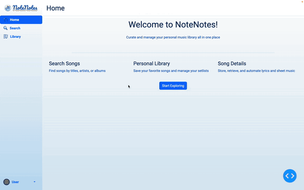

# NoteNotes
<p align="center">
  
</p>
NoteNotes is a web-based music library management application tailored for musicians and music enthusiasts, especially those involved in open mic events and gig performances. This application simplifies the management of song collections, setlists, and associated music resources. Each element of NoteNotes was designed in Figma to ensure a user-friendly experience and consistent branding. The app was developed using Python with the Dash by Plotly framework for robust, interactive web functionality.
<br><br>
The current prototype provides various features such as track searching, storage, and organization of music tracks. Users can also manually or automatically attach lyrics and sheet music to their tracks, which is useful for performance preparation and open-mics. All code is fully modularized and hosted here on GitHub.

## Features
- Music Track Management: Easily add, organize, and manage music tracks in your personal library.
- Setlist Creation: Compile and arrange setlists for gigs and performances.
- Resource Attachment: Attach and manage lyrics and sheet music directly with tracks for easy access.
- Spotify Integration: Source track information directly from Spotify to enrich your music library.

## Setup Instructions
To get started with NoteNotes, follow these setup instructions:

## Environment Variables
Create a .env file in the project root.

Go to the Spotify for Developers website, then create your own app to get your own Client ID and Client Secret.

Add the following lines to your .env file, replacing your_client_id_here and your_client_secret_here with your actual Spotify API credentials:

```
SPOTIFY_CLIENT_ID=your_client_id_here
SPOTIFY_CLIENT_SECRET=your_client_secret_here
```

## Running the App
To run NoteNotes locally:

Install the required Python packages:
```
pip install -r requirements.txt
```

Start the Dash app:
```
python main.py
```
